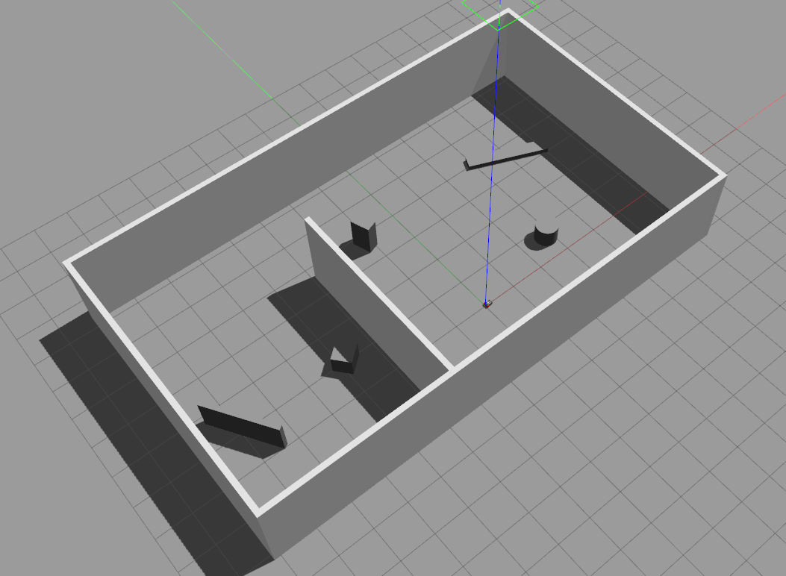

### HI there, I'm Worachit Ketrungsri, I know it's hard to pronounce 
## Please called me Chin 😀 😀 

## About me 🙋‍♂️
I'm an Erasmus Mundus Robotics Engineering Master student at the University de Jaume I and the Université de Toulon. Among top 10% of student during my bachelor's at the King mongkut's university of technology thonburi. Experience in Software Engineer, Robotics, Microcontrollers, PCB Desgined and Machine learning.

## Some of my projects 🎯🎯

- [SEMANTIC SEGMENTATION OF THE ELONGATED STRUCTURE OF GALAXIES](https://github.com/worachit/panoptic-lsb.git)
Part of the internship at university de Toulon. The task is to find a solution to improve the object detection model for elongated structures from low surface brightness (LSB) galaxy images.

- [SAM: A DEVELOPMENT OF INTELLIGENT MEDICAL PLATFORM]()
I developed a Django-based Melanoma classification website with MongoDB, allowing users to upload skin images for pre-diagnostic results. The platform integrates a machine learning model on Google Kubernetes Engine (GKE) via RESTful API. This project was selected for the 2nd World Congress on Undergraduate Research.

- [SIMULATION OF DIFFERENTIAL DRIVE MOBILE ROBOT](https://github.com/worachit/fra_mobile_robot)
I implement a Point cloud SLAM algorithm and navigation system in a customized mobile robot and create a simulation in Gazebo

- [MULTI AGENT DIFFERENTIAL DRIVE ROBOT SIMULATION](https://github.com/worachit/UJI_multirobot.git)
I Participated in the League of Robot Runner competition sponsored by Amazon and designed a
multi-agent path planning algorithm in C++. I also create a simulated the multi-agent path planning algorithm in Webots simulator with ROS2 [Video](https://www.youtube.com/watch?v=SGDj83Y9zyY&feature=youtu.be)

## Skills 💻💻💻💻💻

### Programming 👨🏻‍💻

### Machine learning

### Framework

### Cloud

